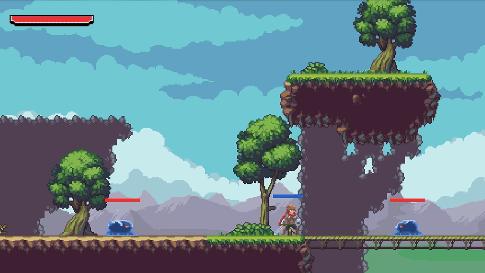
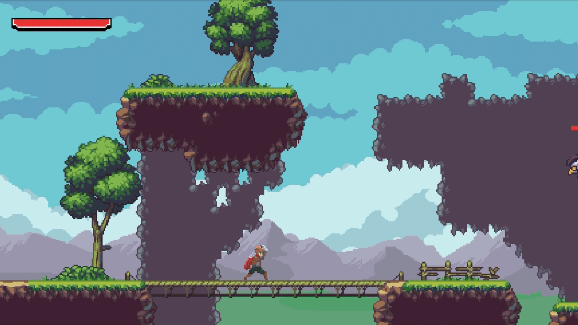
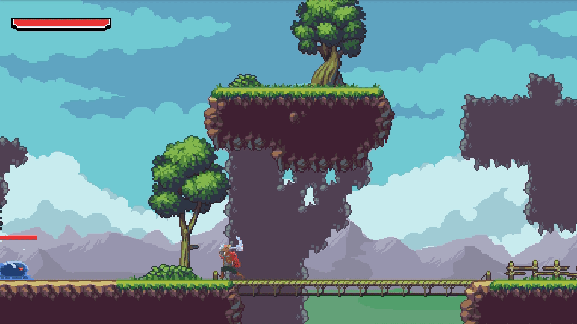
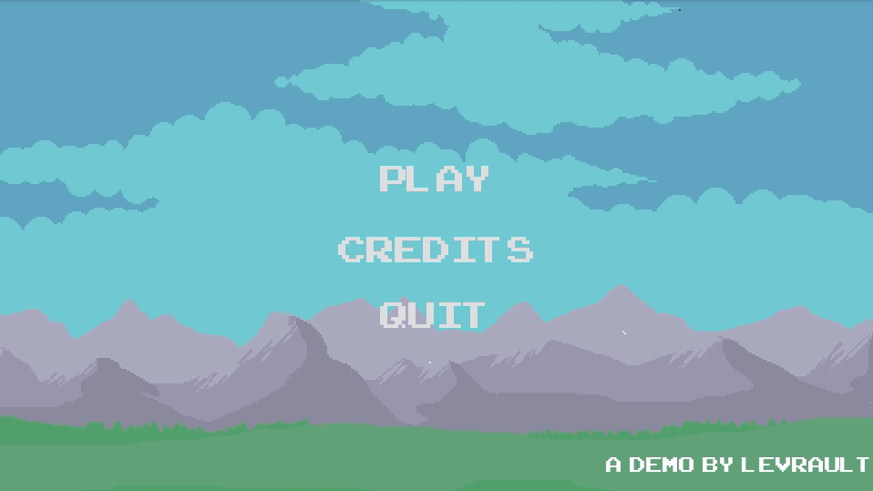

# Godot 2D action adventure platformer demo

Godot 2D action adventure platformer demo will be a "complete" tiny demo that should contains a lot of useful stuffs for people that want to learn [Godot Engine](https://godotengine.org/) and creating their own platformer. 

I hope it should answer the common question : _Damn, how can I code that ?_ by only reading through code instead.

## Features

### Engine

- A basic retro physic engine

- Momentum hitting management (slow time with an ease-in-out effect)

  

- Tilemap system

- Music and sound management

### Player

- A pretty basic but complete character moveset
  - Jump
  - Double jump
  - Getting hit
  - Dying
  - Grounded combo attack
  - Air combo attack

* GUI
  * Cooldown bar between combo
  * Healtbar
  * Pause screen

### Enemies

- Slime
  - A vicious little creature that will follow you if you get to close to him
  
  - Will try to bite you if your too close
  
  - Multiples behaviours (idle, move, attack, getting hit, dying)
  
    
  
- Eagle
  
  - A flying enemy that mind his own business, if you don't get in his path (simple movement path)
  
    
  
- GUI
  
  - Enemy health bar

### Interfaces

- Main menu

- Loading screen 

- Credits Screen

- Game Over screen

  

## Keys

**Move** - wasd, arrow keys

**Jump** - Space bar

**Attack** - F, left mouse click

**Pause** - Escape

*Game is also playable with a game controller*

## GDscript Guidelines

### Naming convention

When a function is linked to a signal, it name should begin with `_on` following by his action with a Maj.

eg. `_on_Death`, `_on_Cooldown_timer`

# License

*This license only cover the code base of this project. Every assets, musics and fonts used to produce this demo are covered by their own license and belong to their owner (all listed in the credits section).* 

Copyright 2019 Luc-Frédéric Langis (Levrault)

Permission is hereby granted, free of charge, to any person obtaining a copy of this software and associated documentation files (the "Software"), to deal in the Software without restriction, including without limitation the rights to use, copy, modify, merge, publish, distribute, sublicense, and/or sell copies of the Software, and to permit persons to whom the Software is furnished to do so, subject to the following conditions:

The above copyright notice and this permission notice shall be included in all copies or substantial portions of the Software.

THE SOFTWARE IS PROVIDED "AS IS", WITHOUT WARRANTY OF ANY KIND, EXPRESS OR IMPLIED, INCLUDING BUT NOT LIMITED TO THE WARRANTIES OF MERCHANTABILITY, FITNESS FOR A PARTICULAR PURPOSE AND NONINFRINGEMENT. IN NO EVENT SHALL THE AUTHORS OR COPYRIGHT HOLDERS BE LIABLE FOR ANY CLAIM, DAMAGES OR OTHER LIABILITY, WHETHER IN AN ACTION OF CONTRACT, TORT OR OTHERWISE, ARISING FROM, OUT OF OR IN CONNECTION WITH THE SOFTWARE OR THE USE OR OTHER DEALINGS IN THE SOFTWARE.

## Credits

This demo was made by using those amazing assets (thanks to their author, that share their works like that). To use those assets, I recommend to directly download it from their official page and follow the license terms. 

### Sprites

[Animated Pixel Adventurer](https://rvros.itch.io/animated-pixel-hero) 

[Free Pixelart Platformer Tileset](https://aamatniekss.itch.io/free-pixelart-platformer-tileset) 

[Sunny Land 2D Pixel Art Pack](https://ansimuz.itch.io/sunny-land-pixel-game-art)

[Slime](https://rvros.itch.io/pixel-art-animated-slime)

[Pixel health bar asset pack](https://adwitr.itch.io/pixel-health-bar-asset-pack) 

### Fonts

[pixelmix font](https://www.dafont.com/fr/pixelmix.font)

[Arcade Classic Font](https://www.1001fonts.com/arcadeclassic-font.html#more) 

### Sounds and musics

[The Essential Retro Video Game Sound Effects Collection [512 sounds] By Juhani Junkala](https://opengameart.org/content/512-sound-effects-8-bit-style) 

[Star Commander1 [music]](https://www.dl-sounds.com/royalty-free/star-commander1)

*Obviously if an asset is not credited, contact me, I always try to credits the asset I use, but something I can just forget to do it.*